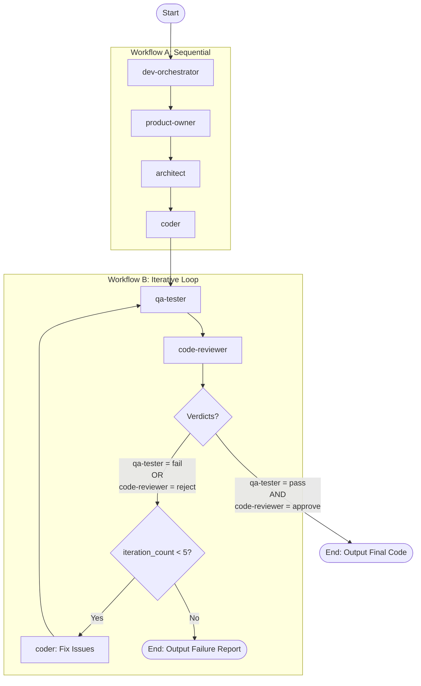

# Orchestration Graph

```mermaid
flowchart TD
    Start([Start]) --> DevOrchestrator[dev-orchestrator]
    
    subgraph Workflow A [Workflow A: Sequential]
        DevOrchestrator --> PO[product-owner]
        PO --> Architect[architect]
        Architect --> Coder[coder]
    end
    
    Coder --> QATester
    
    subgraph Workflow B [Workflow B: Iterative Loop]
        QATester[qa-tester] --> CodeReviewer[code-reviewer]
        
        CodeReviewer --> Split{Verdicts?}
        Split -- "qa-tester = fail\nOR\ncode-reviewer = reject" --> CheckCount{iteration_count < 5?}
        
        CheckCount -- Yes --> CoderFix[coder: Fix Issues]
        CoderFix --> QATester
        
        CheckCount -- No --> FailNode([End: Output Failure Report])
    end
    
    Split -- "qa-tester = pass\nAND\ncode-reviewer = approve" --> EndNode([End: Output Final Code])
```
